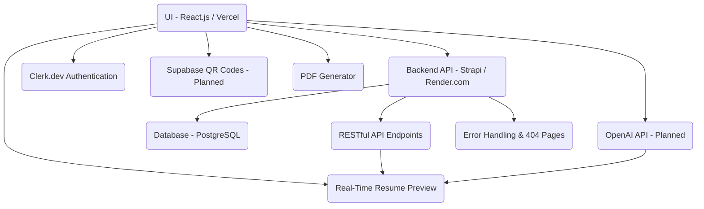

# AI-Powered Resume Builder Web Application

## Overview

The **AI-Powered Resume Builder** is a comprehensive full-stack web application designed to streamline the process of creating professional, ATS-friendly resumes. By leveraging modern frontend frameworks, a headless CMS, and AI-powered tools, this platform empowers users to effortlessly craft, preview, and share their resumes with confidence and flexibility.

---

## Table of Contents

- [Motivation](#motivation)
- [Architecture Diagram](#architecture-diagram)
- [Technologies Used](#technologies-used)
- [Key Features](#key-features)
- [Project Structure](#project-structure)
- [Challenges Faced & Solutions](#challenges-faced--solutions)
- [Learning Outcomes](#learning-outcomes)
- [Impact & Benefits](#impact--benefits)
- [Conclusion](#conclusion)

---

## Motivation

Building a strong, well-structured resume is often a challenge for users, especially when aiming for flexibility and ATS compatibility. Traditional templates lack dynamism and intelligence. This project was created to solve these issues by providing a guided, AI-augmented resume-building process with modern UX and robust data handling.

---

## 🏗️ System Architecture


- **A**: React.js frontend, hosted on Vercel, provides all UI and real-time features.
- **B**: Strapi backend CMS, hosted on Render.com, handles all resume data CRUD operations via REST APIs.
- **C**: Clerk.dev offers OTP phone authentication for secure access.
- **D**: OpenAI API integration (planned) for AI-powered summary generation.
- **E**: Supabase (planned) for generating shareable QR code resume links.
- **F**: Persistent data store for user resumes and related info.
- **G**: API endpoints used by frontend for all data interactions.
- **H**: Resume preview, always in sync with form data and AI summary.
- **I**: In-browser PDF generation/export matching live preview.
- **J**: Server-side error handling and custom 404 page support.
## Technologies Used

### Frontend

- **React.js** – Component-based, responsive UI.
- **Tailwind CSS** – Highly customizable, mobile-responsive styling.
- **ShadCN** – Elegant, accessible UI components.
- **React Router DOM** – Seamless client-side routing and navigation.

### Authentication

- **Clerk.dev** – OTP-based phone authentication for secure, modern login.

### Backend & CMS

- **Strapi (Headless CMS)** – RESTful API endpoints for storing/retrieving resume data, hosted on Render.com.

### Deployment

- **Vercel** – Hosting frontend React application.
- **Render.com** – Hosting Strapi backend CMS.

### Other Tools

- **Vite** – Fast local development and bundling.
- **OpenAI** (Planned) – AI-powered summary generation.
- **Supabase** (Planned) – QR code-based resume sharing.

---

## Key Features

1. **Dynamic Routing**
    - Each resume is accessible via a unique route: `/dashboard/resume/:resumeId/edit`.
    - Enables deep linking and easy sharing.

2. **Component-Based Form Sections**
    - Modular, maintainable sections: Personal Info, Education, Experience, Projects, Skills, and Summary.
    - Each section is isolated for better maintainability and scalability.

3. **Real-Time Resume Preview**
    - Live, side-by-side preview updates as users enter data.
    - Reduces formatting errors and boosts user confidence.

4. **AI-Powered Summary (OpenAI Integration)**
    - Generates tailored professional summaries from user input.
    - Saves time and ensures high-quality content.

5. **PDF Download Support**
    - Download resumes as properly formatted PDFs that match the on-screen preview.

6. **Error Boundaries and Fallbacks**
    - Custom 404 pages for undefined routes.
    - Comprehensive error handling for a smooth experience.

7. **Theme Customization**
    - Tailwind’s primary color customized from purple to blue to match branding.

---

## Project Structure

```
/resume-builder/
├── public/
│   └── ...
├── src/
│   ├── components/
│   │   ├── FormSections/
│   │   ├── Preview/
│   │   └── ...
│   ├── context/
│   │   └── ResumeInfoContext.js
│   ├── routes/
│   ├── utils/
│   ├── App.js
│   ├── main.js
│   └── ...
├── tailwind.config.js
├── package.json
└── ...
```

- **components/FormSections**: Modular form for user inputs.
- **components/Preview**: Live resume preview.
- **context/ResumeInfoContext.js**: Centralized state management for resume data.
- **routes/**: Handles dynamic routing and 404s.

---

## Challenges Faced & Solutions

1. **Summary Not Updating in Preview**
    - *Issue*: Generated summary not reflected in live preview.
    - *Solution*: Synchronized global context (`ResumeInfoContext`) with local state via `useEffect`.

2. **AI Summary Disappearing on Page Change**
    - *Issue*: Navigating between form sections caused loss of AI-generated summary.
    - *Solution*: Centralized data persistence in context and reloaded with `useEffect` on mount.

3. **PDF Download Didn’t Include Summary**
    - *Issue*: Exported PDF missed the AI summary.
    - *Solution*: Ensured summary state is passed to the preview component used for PDF generation.

4. **404 Errors on Shared Links**
    - *Issue*: Deployed links failed due to route misconfiguration.
    - *Solution*: Reorganized nested routes and wrapped them in the main `App` component.

5. **Tailwind Styling Conflicts**
    - *Issue*: Branding required changing the primary color from purple to blue.
    - *Solution*: Overrode default Tailwind config to use a custom blue palette.

---

## Learning Outcomes

- Mastery of full-stack application development with a Headless CMS.
- Real-world experience integrating third-party authentication and CMS.
- Advanced problem-solving with asynchronous data and React context.
- Expertise in client-side routing and navigation.
- Debugging and deployment on Vercel and Render.com.

---

## Impact & Benefits

- **For Users:** Effortless resume creation, AI-powered content, live preview, ATS-friendly output, and secure data handling.
- **For Developers:** Demonstrates proficiency in modern web stacks, context management, and third-party integrations.
- **Accessibility:** Fully mobile-responsive and secure, suitable for all devices and users.

---

## Conclusion

The AI-Powered Resume Builder is a production-ready, scalable, and user-friendly full-stack application. It combines modern React engineering, headless CMS integration, cloud deployment, and AI enhancements. This project serves as a robust portfolio piece, demonstrating expertise in UI/UX, backend integration, and full-stack problem-solving. Every challenge encountered deepened the practical understanding of web development workflows.

---

## License

[MIT](./LICENSE)

---
